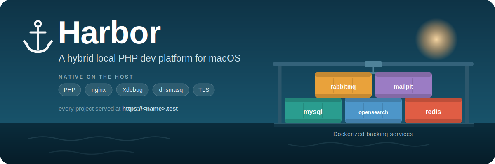

# Harbor

<p align="center">
  
</p>

[](../../actions/workflows/traffic-clones.yml)

**A hybrid local development platform for PHP — macOS only.**

> [!IMPORTANT]
> - **Platform:** **macOS** (Apple Silicon + Homebrew) only. There is no Linux or
>   Windows support, and none is planned.
> - **Status:** **unstable and under active development.** Expect breaking changes
>   between commits; pin to a commit you trust rather than tracking `main` blindly.
> - **Contributions:** **not accepting code contributions / pull requests.** Bug
>   reports and feature ideas are welcome though — please
>   [open an issue](../../issues).

Harbor runs the latency-sensitive, always-on pieces of your stack **natively on
macOS** (PHP-FPM, nginx, Xdebug, dnsmasq, TLS) and pushes the heavy, disposable
backing services into **Docker** (MySQL, OpenSearch, RabbitMQ) — plus a tiny
shared stack for Mailpit and Redis. The result is a light, low-RAM deck that
hosts many projects across different PHP versions and frameworks at once, without
the bloat of a full-container setup or the mess of polluting your Homebrew config.

Works with **plain PHP, Magento, Laravel, Symfony, and CodeIgniter** side by side.

---

## Why Harbor

- **Light on RAM.** PHP runs as concurrent on-demand FPM pools (idle cost is just
  the master process), and you only `up` the database/search stacks you're
  actually working on.
- **Native code, native speed.** Your project files live on the host and are read
  directly by PHP — no slow bind mounts, and Xdebug just works. Containers hold
  only service *data*, never your source.
- **Zero pollution.** Harbor owns all of its config and runs its **own** nginx,
  dnsmasq, and php-fpm. It never writes into Homebrew's `nginx`, `php`, or
  `dnsmasq` config directories. `harbor teardown` removes everything and leaves
  your system exactly as it was.
- **Real-world workflows.** First-class `setup:install` wiring for Magento,
  prod-dump imports with find/replace + credential scrubbing hooks, multi-store
  routing, and trusted local HTTPS for every site.
- **Built for AI coding agents.** Every project is seeded with a **Claude Code
  skill** (`.claude/skills/harbor/`) that teaches an agent how to drive Harbor for
  your app — run commands under the pinned PHP, manage the database, tail logs,
  debug with Xdebug, edit the manifest — so it gets things right without
  re-reading the docs each task. See [For AI coding agents](#for-ai-coding-agents).

---

## Architecture at a glance

| Layer | Runs as | Components |
|-------|---------|-----------|
| **Native (host)** | Harbor-owned launchd units | PHP-FPM (all versions), nginx (one instance, `:80/:443`), dnsmasq (`:5354`), Xdebug, mkcert TLS |
| **Docker — shared** | one always-on stack | Mailpit (`:1025` SMTP / `:8025` UI), Redis (`:6379`) |
| **Docker — per project** | `harbor up`/`down` on demand | MySQL 8, OpenSearch + RabbitMQ (Magento) |

- Every site is reachable at `https://<name>.test` with a trusted certificate.
- Each project that uses a database gets its own MySQL container on an
  automatically allocated port (a project can also run with no services at all —
  see [Optional backing services](#optional-backing-services)).
- Redis and Mailpit are shared; each project gets isolated Redis DB indices and a
  key prefix, and its Redis data is flushed when you bring the project down.

---

## Requirements

Harbor orchestrates tools you install via [Homebrew](https://brew.sh):

```bash
brew install php nginx dnsmasq mkcert
brew install php@8.3 php@8.2 php@8.1   # any versions you need (7.4–8.5 supported)
```

You also need:

- **Docker** (Desktop or compatible) with Compose v2
- **mkcert** with its local CA installed: `mkcert -install`
- **Xdebug** (optional, for step debugging) — Homebrew's PHP doesn't bundle it, so
  install it per PHP version with `pecl`:
  ```bash
  pecl install xdebug            # for the PHP currently first on your PATH
  # for another version, use that version's pecl:
  $(brew --prefix php@8.3)/bin/pecl install xdebug
  ```
  Harbor only needs the built `xdebug.so` to exist — it loads and configures
  Xdebug itself via `-d` flags, so you never edit brew's `php.ini`. If `pecl`
  already enabled it there, Harbor detects that and just toggles `xdebug.mode`.
  Toggle with `harbor xdebug on|off`; `harbor doctor` reports which versions have
  it. On EOL PHP, use a prebuilt binary instead of `pecl` (see [Recipes → D](#d-xdebug-on-an-eol-php)).
- **nvm** (optional, for per-project Node versions)
- **Composer** (optional, global)

Run `harbor doctor` at any time — it reports exactly what's missing and the
command to install it. Harbor never installs anything for you.

---

## Installation

```bash
git clone <your-harbor-remote> ~/harbor        # or wherever you keep it
cd ~/harbor
ln -s "$PWD/bin/harbor" /usr/local/bin/harbor  # put `harbor` on your PATH

harbor doctor      # check the host
harbor setup       # one-time host preparation
```

`harbor setup` is idempotent and re-runnable. It:

1. Renders Harbor's own dnsmasq config and resolves `*.test → 127.0.0.1` (on port
   `5354`), and writes `/etc/resolver/test`.
2. Issues the shared mkcert certificate into `certs/` (per-site SANs are added as
   you `harbor link` sites), and builds a combined CA bundle
   (`certs/harbor-ca-bundle.pem`) so host PHP trusts those hosts for
   server-to-server calls.
3. Renders an on-demand FPM pool for each installed PHP version and loads them as
   launchd agents.
4. Renders Harbor's own `nginx.conf` and loads nginx as a launchd daemon.
5. Brings up the shared Mailpit + Redis stack.

> **Two one-time `sudo` prompts:** installing the nginx LaunchDaemon (needed to
> bind `:443`) and writing `/etc/resolver/test`. Both are removed by
> `harbor teardown`.

Enable shell completion (optional):

```bash
harbor completion zsh  >> ~/.zshrc       # or: bash >> ~/.bashrc
```

---

## Quick start

### Create a new project (one shot)

```bash
harbor new shop laravel
```

This scaffolds the app, allocates ports, brings up its stack (waiting until the
DB is ready), wires its config, runs the installer, links the vhost, and opens
`https://shop.test`.

### Adopt an existing project

```bash
cd ~/harbor/projects                      # projects live here
git clone <repo> shop
cd shop && echo "8.3" > .php-version       # pin a PHP version (optional)

harbor init shop --existing                # allocate + write manifest, no scaffold
harbor up shop                             # start its MySQL (+ OpenSearch/RabbitMQ)
harbor wire shop                           # inject DB/Redis/mail config (never clobbers)
harbor link shop                           # create https://shop.test
harbor open shop
```

### Refresh from production

```bash
harbor db pull shop          # ssh mysqldump -> strip DEFINERs -> hooks -> import
                             #   -> serialized-safe replace -> scrub credentials
harbor media pull shop       # rsync media/storage (excludes caches)
```

---

## How-to (recipes)

Step-by-step for the common flows. Assumes `harbor` is on your PATH and
`harbor setup` has been run once.

### A. Create a brand-new project
```bash
harbor new shop laravel      # scaffold → init → up → wire → install → link → open
```
That's the whole thing. The manual equivalent (any step is runnable on its own):
```bash
harbor init shop laravel     # allocate ports, write manifest + compose
harbor up shop               # start MySQL (+ OpenSearch/RabbitMQ for Magento)
harbor composer shop create-project laravel/laravel .   # get the code
harbor wire shop             # inject DB/Redis/mail into the app config
harbor install shop          # key:generate + migrate (framework-aware)
harbor link shop             # https://shop.test (adds cert SAN, reloads nginx)
harbor open shop
```

### B. Migrate an existing app into Harbor
Say the app lives at `/path/to/app` (`~/harbor` is used below as the Harbor
install dir — substitute wherever you cloned it).

```bash
# 1. get the code under projects/ (copy, or symlink to keep one source of truth)
rsync -a /path/to/app/ ~/harbor/projects/myapp/
#   ln -s /path/to/app ~/harbor/projects/myapp   # alt: symlink

# 2. pin the PHP version the app needs (see recipe C for EOL versions)
printf '8.3\n' > ~/harbor/projects/myapp/.php-version

# 3. provision + start (framework auto-detected; override with a positional arg)
harbor init myapp --existing --php 8.3
harbor up myapp

# 4. bring the database over — from a SQL dump of your current database,
#    produced however your data lives now (e.g. mysqldump):
mysqldump -h <host> -u <user> -p --single-transaction --no-tablespaces <db> | gzip > /tmp/myapp.sql.gz
#    import into Harbor (auto-backup, DEFINER-strip, hooks, serialized-safe replace):
harbor db import myapp /tmp/myapp.sql.gz
#    optional domain rewrite: harbor db import myapp /tmp/myapp.sql.gz --replace old.com=myapp.test

# 5. wire config, then serve
harbor wire myapp            # Laravel/Symfony/CI4: edits .env/.env.local surgically
harbor link myapp            # https://myapp.test (TLS is automatic — no separate step)
harbor open myapp
```
Config wiring by framework:
- **Laravel / Symfony / CI4** → `harbor wire` does it.
- **CI3 / plain PHP** → `harbor wire` writes `.harbor/connection.php` and prints the
  values; copy host/**port**/db/user/pass into your config (use `127.0.0.1`, never
  `localhost`). Find them any time in `projects/myapp/.harbor/connection.txt`.
- **Magento** → `harbor install myapp` (fresh) or `harbor db import myapp <dump> --reconfigure`
  (existing dump); sets base URLs, search, cache/session in `env.php`.

Verify: `harbor ps` shows it, then
`curl -sI https://myapp.test` (trusted cert), and `harbor logs myapp` / the app's
own log if a page errors.

### C. Use an EOL PHP version (7.2 / 7.3 / 8.0)
Not in homebrew-core — install from the shivammathur tap, then let Harbor pick it up:
```bash
brew install shivammathur/php/php@7.2
harbor php sync              # creates the 7.2 ondemand pool
```
Then pin it per project (`.php-version` and/or manifest `php: "7.2"`, then
`harbor link <name>` to re-point the vhost).

### D. Xdebug on an EOL PHP
Old Xdebug won't compile with current clang, so use a prebuilt binary — **not** pecl:
```bash
brew install shivammathur/extensions/xdebug@7.4
harbor xdebug on            # trigger-based; set XDEBUG_TRIGGER / use a browser ext
```
(No need to edit brew's php.ini — Harbor detects an already-loaded Xdebug and just
toggles `xdebug.mode`.)

### E. Old app can't connect to MySQL 8 (`caching_sha2_password`)
New projects are fine (Harbor's MySQL defaults to the native auth plugin). For a
project created before that, flip the existing user once:
```bash
harbor mysql myapp -e "ALTER USER 'myapp'@'%' IDENTIFIED WITH mysql_native_password BY 'myapp'; FLUSH PRIVILEGES;"
```

### F. Change a project's PHP version
Edit `projects/<name>/.harbor/harbor.yml` `php:` (and `.php-version`), then:
```bash
harbor link <name>          # re-points the vhost fastcgi to the new pool's socket
```
No `up`/re-import needed — PHP is host-side, the DB is untouched.

### G. Switch between Harbor and another local Docker stack
```bash
harbor stop                              # frees :80/:443/:6379/:1025/:8025
cd /path/to/other-stack && docker compose up -d
# …later, back to Harbor:
cd /path/to/other-stack && docker compose down
harbor start
```
Per project: `harbor down <name>` parks one stack (keeps its DB volume),
`harbor up <name>` resumes, `harbor destroy <name>` removes it entirely.

---

## Core concepts

### Domains & TLS

Every linked site answers at `https://<name>.test`, resolved locally by Harbor's
dnsmasq and served with a trusted certificate. `harbor link` adds the site's
**exact** hostname to the shared cert and reissues it (a bare `*.test` wildcard
isn't trusted by Safari/Chrome, since `.test` is a reserved public suffix —
trust comes from the per-site SAN). Extra hostnames (client/legacy domains) can
be added per project via the manifest `domains:` key.

Harbor also builds a combined CA bundle (system CAs + the mkcert root) and points
host PHP at it, so **projects can call each other over HTTPS with full TLS
verification** — see [Running projects side by side](#running-projects-side-by-side).

### PHP versions

All installed PHP versions run **concurrently** as on-demand FPM pools, so a
Magento site on 8.3 and a Laravel site on 8.4 can run at the same time. A site
picks its version with a `.php-version` file (or `harbor link --php 8.3`); nginx
routes the site to the matching pool. `harbor php` shows pool status and sets the
default version for new sites.

> **PHP is the only multi-version layer.** nginx is not: Harbor runs exactly one
> nginx (the brew-installed one, on `:80/:443`) that serves every site, and there
> is no way to pin a project to a different nginx version. Per-site differences
> are expressed in that shared nginx's config — the vhost Harbor renders at
> `link`, plus an optional `.harbor/nginx.conf` snippet — not by running a second
> nginx.

### The project manifest

Each project's topology lives in one committable file,
`projects/<name>/.harbor/harbor.yml` — the single source of truth that every
command reads:

```yaml
framework: magento          # plain | laravel | symfony | codeigniter | magento
php: "8.3"                  # pinned version
node: "20"                  # optional (-> .nvmrc)
docroot: pub                # override the auto-detected web root (optional)
domains: [shop.test]        # extra hostnames beyond <name>.test (optional)
extensions: [imagick, redis]    # required PHP extensions (doctor validates)
php_ini: { memory_limit: 2G, "opcache.validate_timestamps": 1 }
services: { mysql: "mysql:8.0", opensearch: "opensearchproject/opensearch:2.19.0", rabbitmq: "rabbitmq:3.13-management-alpine" }
db:        { name: shop, user: shop, password: shop }   # image lives in services.mysql
multistore: { mode: domain, stores: { de: de.shop.test, fr: fr.shop.test } }
import:    { strip_definers: true, rules: import-rules }
remote:    { host: user@prod, db: shopdb, media: /var/www/pub/media }
```

Generated/runtime files (`connection.env`, `compose.env`, `docker-compose.yml`)
are gitignored; the manifest, `import-rules`, `hooks/`, and `scripts/` are
committable, so a teammate can clone the repo and `harbor up` to reproduce the
same stack.

**Per-project scripts** — drop executables in `projects/<name>/.harbor/scripts/`
(`chmod +x`); they're on `PATH` — under the project's pinned PHP — for
`harbor run <name> <script>` and `harbor shell <name>`. So a `scripts/invoice`
becomes `harbor run <name> invoice` — or just `harbor run invoice` from inside the
project (the name is inferred from your cwd). Unlike the generated `.harbor/bin/`
tool shims, this dir is committable, so project-specific commands travel with the app.

**Agent skill** — `harbor init`/`harbor new` also seed the project with a Claude
Code skill at `.claude/skills/harbor/`, so a coding agent working on the app knows
how to drive Harbor (run commands under the pinned PHP, DB import/backup/sandbox,
logs, Xdebug, manifest config, containerized tools) without re-reading the whole
tool. It's committable and non-clobbering — delete the dir to pull a fresh copy on
the next `init`.

### Ports & shared Redis

Each project receives a contiguous block of host ports (`base = 20000 + N*20`),
written to `.harbor/connection.txt`. Redis is shared, so each project instead
gets a block of Redis DB indices (cache / page_cache / session / spare) plus a
key prefix. Bringing a project down flushes only its Redis indices, so the shared
instance never grows large.

### Databases

The project's primary database/user/password are auto-provisioned on first boot
using a simple convention: **if user/password aren't specified, the database name
is used for both**, and the database name defaults to the project name. So
`harbor db create shop` creates database `shop`, user `shop`, password `shop`.

### Sandbox — throwaway databases, no project

For quick testing and checking things out, Harbor runs an optional
**project-independent** MySQL server on `127.0.0.1:3306` — spin up databases and
tear them down without attaching them to a project:

```bash
harbor db sandbox create test [user] [pass]   # first use auto-starts the server
harbor db sandbox list                         # what's in there
harbor db sandbox backup test                  # -> backups/db/sandbox/
harbor db sandbox restore test dump.sql.gz     # load a dump (.sql/.gz/.zip)
harbor db sandbox console [test]               # interactive mysql shell
harbor db sandbox drop test [user]             # drop a database (+ its user)
harbor db sandbox down | destroy               # stop (keep data) | drop the volume
harbor db sandbox status
```

Same credential convention as projects (user/pass default to the database name).
It's a Harbor-owned singleton: loopback-only, lazily started, and fully
reversible — `harbor teardown` stops it, `harbor teardown --purge` drops its data
volume. The port and image are overridable in `~/.config/harbor/config`
(`SANDBOX_MYSQL_PORT`, `SANDBOX_MYSQL_IMAGE`); set a `mariadb:*` image to run
MariaDB instead. Because it binds the standard `:3306`, stop any other local MySQL
first (or change the port).

---

## Running projects side by side

Running many projects at once — say an **API provider** plus several
**consumers** — is the normal case, not a special mode. One nginx serves every
site, the on-demand FPM pools run them all concurrently, the wildcard cert covers
them, and the port allocator keeps their stacks from colliding:

```bash
harbor up api web admin       # bring up three project stacks at once
```

A consumer reaches the provider over TLS, by name:

```php
// in project "web", calling project "api"
$res = Http::get('https://api.test/v1/orders');   // verifies cleanly
```

This works end to end because:

- **DNS** — `api.test` resolves to `127.0.0.1` for PHP too (macOS honors
  `/etc/resolver/test`, which curl/PHP use), so no `/etc/hosts` editing.
- **Routing** — the request hits the shared nginx, which routes by `Host` to the
  provider's pool.
- **TLS verifies** — host PHP uses Harbor's combined CA bundle (system CAs +
  mkcert root), so `https://api.test` validates without `verify => false` hacks.

**Tip:** a provider and its consumers on the *same* PHP version share one
on-demand pool, and a synchronous call chain holds one worker per hop. For deep
or high-concurrency chains, either raise `pm.max_children` or put the provider on
a **different** PHP version so it gets its own pool.

---

## Database & import workflow

`harbor db import` is a pipeline you can hook at both ends. Rules and hooks are
validated **before any work starts** — a malformed rule (missing `=>`, invalid
`re:` regex) or a broken shell hook aborts immediately, and a hook that would be
silently skipped (forgotten `chmod +x`, a `*.sql` in `pre-import.d/`) warns:

1. **Decompress** (`.sql`, `.sql.gz`, `.zip`), then **refuse a truncated dump** —
   one that ends mid-statement loads only the tables before the cut, silently.
   `--force` loads the partial dump anyway.
2. **Strip DEFINER** clauses automatically (so a missing prod user can't break the
   import). Disable with `--keep-definers`.
3. **Pre-import hooks** — every executable in `.harbor/hooks/pre-import.d/` runs
   with `$HARBOR_DUMP`, e.g. `sed -i "$HARBOR_DUMP" …`.
4. **Load** into the project's MySQL.
5. **Serialized-safe search/replace** — applies rules from `.harbor/import-rules`
   and `--replace OLD=NEW`, recomputing PHP serialized lengths so blobs stay valid.
6. **Post-import hooks** — `.harbor/hooks/post-import.d/` run against the live DB
   (with `$HARBOR_MYSQL`); `*.sql` files are piped in, scripts are executed — the
   place to scrub live credentials, API keys, etc.
7. **Magento `--reconfigure`** (optional) — rewrite base URLs and search host.

A backup is taken before every import (`--no-backup` to skip). Global hooks in
`etc/hooks/` apply to every project (e.g. an org-wide credential scrub).

**You don't have to start from scratch** — `harbor init`/`new` (and
`harbor render` for existing projects) seed a commented-out
`.harbor/import-rules` plus one sample hook per phase
(`hooks/pre-import.d/10-trim-dump.sh.sample`,
`hooks/post-import.d/10-local-overrides.sql.sample` — the place to force table
records to local values, e.g. base URLs or a dev password, on every import).
Everything is inert until you uncomment a rule or rename a `.sample` away.

**Example** — `projects/shop/.harbor/import-rules`:

```
live.com            => local.test
https://cdn.live.com => https://shop.test
re:UA-\d+-\d+       =>
```

---

## Configuration

- **Global defaults** live in `~/.config/harbor/config` (default PHP version,
  locale/currency/timezone, admin credentials, MySQL root password, OpenSearch
  heap, etc.).
- **Per-project** settings live in the manifest and override the global defaults.

Customizations supported per project:

- **Docroot** — `docroot:` for apps with non-standard web roots.
- **nginx rules** — drop a `.harbor/nginx.conf` snippet; it's included in the
  site's `server {}` block (the escape hatch for legacy `.htaccess`-style apps).
- **php.ini** — `php_ini:` is applied per-site for web (via `PHP_VALUE`) **and to
  the project's CLI** (`run`/`composer`/`magento`/`artisan`/…, via `-d` flags), so
  e.g. `memory_limit: 2G` applies to `harbor magento setup:di:compile` too, not
  just web requests. Projects on the same PHP version can differ.
- **Extensions** — `extensions:` is validated by `harbor doctor <name>`.

### Optional backing services

Each project's stack is assembled from the manifest `services:` map — one compose
**fragment** per service — where each entry is `<name>: "<image:tag>"`, so every
version is explicit and editable in place. Bundled: `elasticsearch`,
`meilisearch`, `mysql`, `opensearch`, `rabbitmq` (a plain project defaults to
just `mysql`; Magento to mysql + opensearch + rabbitmq). `harbor init` writes
the map with pinned defaults:

```yaml
services: { mysql: "mysql:8.0", meilisearch: "getmeili/meilisearch:v1.12" }
```

**Choosing services at init.** `harbor init` asks which services a project
needs — a numbered picker (alphabetical, matching the catalog order above) that
appears whenever stdin is a terminal and `HARBOR_YES` is unset:

```
Services for 'shop'  (framework: laravel)
  1) elasticsearch
  2) meilisearch
  3) mysql            *default
  4) opensearch
  5) rabbitmq
Select [Enter = defaults · numbers e.g. "1 3" · "none"]:
```

Or skip the prompt with `--services "mysql,opensearch"` (comma- or
space-separated). Scripted/non-interactive calls (no TTY, or `HARBOR_YES=1`)
silently take the framework default, so existing automation is unaffected.

**No database at all.** `--services ""` or `--services none` (or typing `none`
at the prompt) means **no containers whatsoever** — the manifest gets an empty
`services: {}`, and the project has no `docker-compose.yml`. For a service-less
project: `harbor up`/`down`/`restart <name>`/`logs <name>` are no-ops (not
errors); `harbor db …`/`harbor mysql` refuse with a fix hint instead of
running; `harbor doctor <name>` doesn't require `pdo_mysql`; Magento `install`/
`wire` refuse up front, naming every missing required service, since Magento
requires `mysql` + `opensearch` (RabbitMQ is optional); `harbor ps` shows `db:-`. Add a database later with
`harbor services add <name> mysql && harbor up <name>` (or edit `services:` by
hand and run `harbor render <name> && harbor up <name>` — see below); either
way, render will ask before dropping anything that already has data. (If a project
DOES have a `mysql` service but its ports were never allocated — e.g. a
missing `var/ports/<name>` file — `harbor ps` shows `db:?` instead, which
means "needs attention", not "no database".)

The manifest's `services:` key is authoritative whenever it's present —
**including when it's an explicit empty map** — so an old project without a
`services:` key at all still falls back to the framework default and keeps
working unchanged.

To **change a version**, edit the value; to **add or remove** a service, use
`harbor services add|rm <name> <svc>...` (or edit `services:` by hand) then:
```bash
harbor render <name>              # regenerate docker-compose.yml + connection.env
harbor up <name>                  # apply
```
`harbor services list <name>` shows what's currently on/off, and bare
`harbor services <name>` opens the same interactive picker as `init`, with the
project's current services preselected.
A machine-wide default for a fresh project's pin comes from `~/.config/harbor/config`
(`OPENSEARCH_IMAGE`, `ELASTICSEARCH_IMAGE`, `RABBITMQ_IMAGE`, `MEILISEARCH_IMAGE`,
`MYSQL_IMAGE` — uppercased service name + `_IMAGE`).

**MariaDB** isn't a separate service — it's a MySQL-compatible image swap on the
`mysql` entry, so `harbor mysql`/`db import`/wiring keep working:

```yaml
services: { mysql: "mariadb:11.4" }   # then: harbor render <name> && harbor up <name>
```

Harbor emits an engine-aware server command (MariaDB doesn't take MySQL 8's
`--default-authentication-plugin`), so the swap boots cleanly.

Meilisearch's host + key land in `.harbor/connection.txt` (Laravel Scout:
`SCOUT_DRIVER=meilisearch`, `MEILISEARCH_HOST`, `MEILISEARCH_KEY`).

**Adding another service** (e.g. Postgres, Valkey): drop a
`templates/compose/services/<svc>.yml.tmpl` (loopback bind, healthcheck, RAM cap,
`{{<SVC>_IMAGE}}` for the version) and, if it has a named volume,
`templates/compose/volumes/<svc>.yml.tmpl`; add a `_service_image_default` case,
claim the next free port offset in `lib/ports.sh` (`_ports_write`), and add its
host/port to `connection.env`. Then `services: { <svc>: "…" }` picks it up.
(`meilisearch` is the worked example.)

> Projects created before the map format (`services: [ … ]` + `db.image`) are
> migrated in place the next time you run `harbor render` — the pinned versions
> are filled in and the redundant `db.image` folded into `services.mysql`.

---

## Containerized CLI tools (no host installs)

Some apps shell out to external binaries — `wkhtmltopdf`, `ghostscript`,
LibreOffice (`soffice`), ImageMagick (`convert`), `ffmpeg`, `pandoc`. Instead of
installing these on your Mac, declare them per project and Harbor runs each in a
throwaway container behind a transparent shim:

```yaml
# in .harbor/harbor.yml
tools: [wkhtmltopdf, ghostscript]
# or with a custom image:
# tools: { wkhtmltopdf: { image: surnet/alpine-wkhtmltopdf:..., bin: wkhtmltopdf } }
```

Harbor generates a shim at `.harbor/bin/<tool>` that runs the real tool in a
container with your project dir **and** the system temp dir mounted at identical
paths (so the absolute temp paths PHP libraries pass through resolve correctly).
The shims are on `PATH` for `harbor run`/`harbor shell`; for web requests, point
your library's binary path at the shim, e.g. Laravel Snappy:

```php
'binary' => base_path('.harbor/bin/wkhtmltopdf'),
```

By default each call is ephemeral (`docker run --rm`, no resident RAM); a
`resident` mode keeps a warm container for call-heavy workloads. The host stays
clean — the same approach works for any CLI dependency.

> This is for external *binaries*. PHP *extensions* (like `imagick`) are
> in-process and still need a `pecl` install for that PHP version — `harbor
> doctor <name>` tells you which are missing.

> **macOS:** your projects directory and `$TMPDIR` must be in Docker Desktop's
> file-sharing list; `harbor doctor` checks this and prints the fix.

---

## Xdebug

```bash
harbor xdebug on        # enable for all pools (trigger-based, so cheap)
harbor xdebug off
harbor xdebug status
```

Xdebug is layered on at launch (no edits to your Homebrew PHP config). It uses
`start_with_request=trigger` on port `9003`, so it only engages when your
client/IDE sends the trigger — that's why leaving it on is cheap.

The toggle covers **both surfaces from the same settings**: web requests (the FPM
pools) *and* the project CLI (`harbor run`/`composer`/`magento`/`artisan`/…). To
debug a CLI command, send the trigger with an env var:

```bash
XDEBUG_TRIGGER=1 harbor magento setup:upgrade    # breakpoints hit in your IDE
harbor magento setup:upgrade                     # no trigger, no debug session
```

For the browser, use a trigger extension (Xdebug helper) or append
`?XDEBUG_TRIGGER=1`. Both surfaces connect to `127.0.0.1:9003`.

---

## For AI coding agents

Harbor is designed to be driven by AI coding agents, not just humans. Every
project Harbor creates (`harbor new`/`harbor init`) is seeded with a **Claude Code
skill** at `projects/<name>/.claude/skills/harbor/`:

- **`SKILL.md`** — the daily driver: the one rule (*go through `harbor …`, never
  bare `php`/`composer`/`npm`*), running code/tests/REPL, database + sandbox, stack
  lifecycle, Xdebug from the CLI, logs, editing the manifest, containerized tools,
  and the gotchas that bite (`127.0.0.1` not `localhost`, non-default ports).
- **`reference.md`** — the full command table, manifest schema, and import pipeline.

So an agent working in your app knows how to use Harbor correctly the first time,
without re-reading this README each task. The canonical source lives in
`ai/skills/harbor/`.

- **Existing projects** pick it up on the next `harbor render <name>` (safe — it
  never touches your manifest), or you can copy `ai/skills/harbor/` into the
  project's `.claude/skills/` by hand.
- The copy is **committable** (it travels with the app) and **non-clobbering**, so
  your edits survive a re-`render`/`init`. Delete the dir to pull a fresh copy.

Harbor itself also ships repo-level skills (`.claude/skills/harbor-*`) for agents
**building or adopting** Harbor — a different audience from the per-project skill
above.

## Command reference

> **Every command documents itself**, and the topic is more complete than the
> tables below — those are a summary, the topic is the contract for a command's
> flags (every flag it parses is listed there).
>
> ```bash
> harbor help                 # every command, one line each
> harbor help db              # one command: flags, examples, gotchas
> harbor db --help            # the same topic, shorter to type
> harbor db sandbox --help    # subcommands have topics too
> harbor help db sandbox      # same
> ```
>
> A topic gives you the purpose, the exact usage, **every flag**, a couple of real
> examples, and the gotchas — `harbor down` also flushes the project's Redis;
> `harbor media pull` is `rsync --delete` and won't ask first. Help prints to
> stdout and exits `0`, so `harbor db --help | less` works.
>
> Ask however you like — `harbor php --help`, `harbor php use --help` and
> `harbor help php` all reach the same place.
>
> Commands that wrap another tool (`run`, `composer`, `artisan`, `console`,
> `spark`, `magento`, `node`, `npm`) pass `--help` **through** to that tool, so
> `harbor composer --help` reaches Composer — from inside a project, or with a
> project name (`harbor composer shop --help`), since the tool still has to run
> somewhere. Harbor's own docs for those are at `harbor help composer`. Same for a
> containerized tool's own flags: `harbor tool shop wkhtmltopdf --help` is
> wkhtmltopdf's help, while `harbor tool --help` is Harbor's.

### Host & lifecycle

| Command | Description |
|---------|-------------|
| `harbor doctor [<name>]` | Report host requirements (and a project's PHP extensions). Report-only. |
| `harbor setup` | One-time host preparation (DNS, TLS, FPM pools, shared stack). |
| `harbor stop` / `harbor start` | Pause/resume Harbor's own services (frees `:80/:443/:6379/:1025/:8025` for another stack). |
| `harbor restart` | Restart Harbor's own services — `stop` then `start`. Project stacks are left alone. |
| `harbor teardown [--purge]` | Remove all Harbor launchd units, resolver entry, and config. |
| `harbor update [--check\|--stash]` | Self-update: fast-forward the checkout to `origin/main` and reseed the agent skill into every project. `--check` reports pending commits (read-only); `--stash` auto-stashes a dirty tree. |
| `harbor status` | Active pools, linked sites, running stacks, allocated ports. |
| `harbor ps` / `harbor list` | Status of all projects. |

### PHP

| Command | Description |
|---------|-------------|
| `harbor php [<ver>]` | Show pool status / set the default version for new sites. |
| `harbor php sync` | Re-create pools after `brew install`/uninstall of a `php@x`. |
| `harbor php use <ver>` | Switch the **brew-linked** CLI `php` (plain terminal / IDE / global composer): unlinks the current version, links `<ver>`. Independent of Harbor's per-project pinning — `harbor run`/nginx still use each project's own version. |
| `harbor xdebug on\|off\|status` | Toggle Xdebug across pools. |

### Projects

| Command | Description |
|---------|-------------|
| `harbor new <name> <framework>` | Scaffold + init + up + wire + install + link + open. |
| `harbor init <name> [framework] [--services "a,b"]` | Allocate ports, write manifest (`--existing` for adopted code). `--services` picks the backing services (`""`/`none` = no containers); omit it to be asked interactively, or to get the framework default when not on a terminal. |
| `harbor render <name>` | Regenerate `docker-compose.yml` + `connection.env` from the manifest (after editing `services:`); materializes a legacy list-format `services:` into the explicit map. **Confirms** before dropping a service whose data volume still exists — data is kept, not deleted (`HARBOR_YES=1` skips). |
| `harbor services <name>` \| `list\|add\|rm <name> [svc...]` | Inspect or change a project's backing services after init. Bare `<name>` opens the picker (current selection preselected); `add`/`rm` are idempotent no-ops when the service is already/not present. Writes the manifest and re-renders (does **not** run `harbor up`). **Confirms** before dropping a service whose data volume still exists (`HARBOR_YES=1` skips). |
| `harbor link <name>` | Create the `https://<name>.test` vhost (adds the cert SAN, reloads nginx). A Magento project with `multistore.mode: domain` also gets `*.<name>.test` automatically. |
| `harbor unlink <name>` | Remove the vhost. |
| `harbor wire <name> [--print]` | Inject DB/Redis/mail config into the app (surgical, never clobbers). |
| `harbor up\|down\|restart <name>` | Start/stop/restart the project's Docker stack (`down` flushes its Redis). Bare `harbor restart` restarts Harbor itself. No-ops (not errors) for a project with no services. |
| `harbor destroy <name> [--files]` | Remove stack + volumes, vhost, ports, Redis (confirm-gated). |
| `harbor open <name>` | Open the site in your browser. |
| `harbor logs <name> [service] [-f]` | Tail project/service logs. |
| `harbor logs nginx\|php\|dnsmasq [-f]` | Tail Harbor's own platform-service logs. |
| `harbor logs clear [all\|nginx\|php\|dnsmasq\|<name>]` | Truncate Harbor's log files in place (default `all`; `<name>` clears that site's nginx logs). Safe while daemons run — keeps the inode. nginx logs are user-owned, so no sudo is needed. |

### Running code

| Command | Description |
|---------|-------------|
| `harbor run [<name>] <cmd…>` | Run any command under the project's PHP, in its dir (`.harbor/scripts/` + tool shims on PATH). `<name>` is optional when you're inside the project (cwd under `projects/<name>/` or in a `harbor shell`). |
| `harbor artisan\|console\|spark [<name>] …` | Framework console passthroughs. |
| `harbor magento [<name>] …` | `bin/magento` passthrough (+ local-DX helpers). |
| `harbor composer [<name>] …` | Composer under the project's PHP version. |
| `harbor node\|npm [<name>] …` | Node/npm via nvm + `.nvmrc`. |
| `harbor tool <name> <tool> …` | Run a containerized CLI tool (wkhtmltopdf, …). |
| `harbor tools sync <name>` | (Re)generate tool shims from the manifest. |
| `harbor install <name>` | Framework installer (Magento `setup:install`, Laravel migrate, …). |
| `harbor seed <name>` | Framework seeders / migrations. |

### Consoles

| Command | Description |
|---------|-------------|
| `harbor mysql [<name>]` | MySQL client into the project DB. |
| `harbor redis [<name>]` | redis-cli scoped to the project's DB index. |
| `harbor shell [<name>]` | Shell in the project dir with its PHP/Node on PATH. |

> For all of the above, `<name>` is optional when you're inside a project (cwd under
> `projects/<name>/`, or in a `harbor shell`); an explicit existing-project arg wins.

### Databases

| Command | Description |
|---------|-------------|
| `harbor db create <name> [db] [user] [pass]` | Create DB + user (defaults: db=project, user=db, pass=db). |
| `harbor db drop <name> [db]` | Drop a database (confirm-gated). |
| `harbor db backup <name> [db] [file]` | Dump to `backups/db/<name>/<timestamp>.sql.gz`. |
| `harbor db import <name> <file> [db]` | Hookable import pipeline (see above). `--force` = best-effort: skip server-rejected statements, load truncated dumps. |
| `harbor db pull <name>` | Pull a remote dump straight into the import pipeline. |
| `harbor media pull <name>` | rsync remote media/storage. |
| `harbor redis [<name>] [args…]` | `redis-cli` on the project's **cache** index; args pass through (e.g. `harbor redis shop FLUSHDB`). `harbor down <name>` flushes all four of its indices. |

> `harbor db …`/`harbor mysql` require a `mysql` service. A project with none
> (see [Optional backing services](#optional-backing-services)) gets a fix hint,
> not a "stack not running" error.

### Multi-store (Magento)

| Command | Description |
|---------|-------------|
| `harbor store add <name> <code> --domain <host>` | Subdomain store (`store.<name>.test`). |
| `harbor store add <name> <code> --path <seg>` | Path store (`<name>.test/<seg>`). |
| `harbor store list\|rm <name> …` | Manage store routing. |

A project uses **one** multi-store mode (domain *or* path), set in the manifest.

### Shared services & TLS

| Command | Description |
|---------|-------------|
| `harbor mail up\|down` | Control the shared Mailpit + Redis stack. |
| `harbor secure [host…]` | (Re)issue the wildcard cert / add extra SAN hosts. |
| `harbor completion bash\|zsh` | Print the shell-completion script. |
| `harbor test [filter]` | Run Harbor's own pure-bash unit suite (`test/`); optional name filter. |

---

## Per-framework notes

- **Magento** — per-project MySQL + OpenSearch + RabbitMQ; shared Redis (page
  cache / cache / session) and Mailpit. `harbor install` runs a fully wired
  `setup:install`; the local-DX pack disables 2FA, sets developer mode, and
  reindexes. Multi-store via subdomain or path. No Varnish, no cron by design.
- **Laravel** — `public/` docroot; `.env` wired in place (key-by-key); queues via
  `harbor run <name> 'php artisan queue:work'`.
- **Symfony** — `public/` (or legacy `web/`); config written to `.env.local` only,
  so the committed `.env` is never touched.
- **CodeIgniter** — CI4 (`public/`, `spark`) and CI3 (app root) supported.
- **Plain PHP** — set `docroot:` and add a `.harbor/nginx.conf` snippet for any
  custom routing.

---

## Uninstall

```bash
harbor teardown          # remove launchd units, resolver entry, stop services
harbor teardown --purge  # also drop rendered config and certs
```

Your Homebrew nginx/php/dnsmasq installs and their config remain untouched.

---

## Known limitations / not (yet) managed

- **Workers/queues** aren't supervised by Harbor — run them with `harbor run`.
- **Vite/webpack HMR** over a TLS `.test` site needs a small tweak in the app's
  dev-server config (documented per project); Harbor doesn't auto-wire it.
- **Xdebug** currently toggles debug mode; profile/coverage modes are planned.
- **Non-`.test` domains** resolve via `/etc/hosts` (Harbor prints the line to
  add); only `*.test` is handled automatically by dnsmasq.

---

## How it stays clean

Harbor renders all of its nginx, php-fpm, and dnsmasq configuration into its own
`etc/` directory and runs its own instances of each service via Harbor-owned
launchd units. Nothing is written into Homebrew's config trees. The only files
Harbor places outside its own directory are the nginx LaunchDaemon, the per-pool
and dnsmasq LaunchAgents, and `/etc/resolver/test` — all removed by
`harbor teardown`.

---

## License

[MIT](LICENSE) © Alaa Al-Maliki. Provided "as is", without warranty of any kind
(see [LICENSE](LICENSE)).
